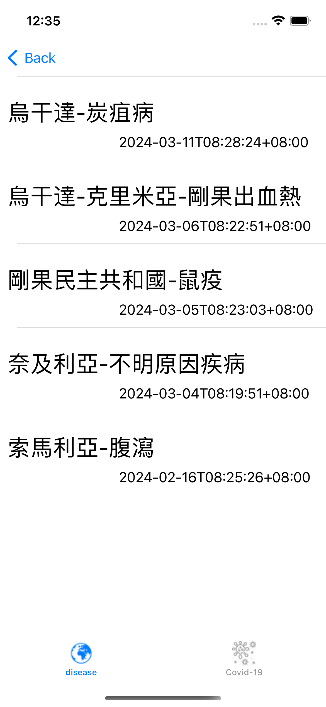
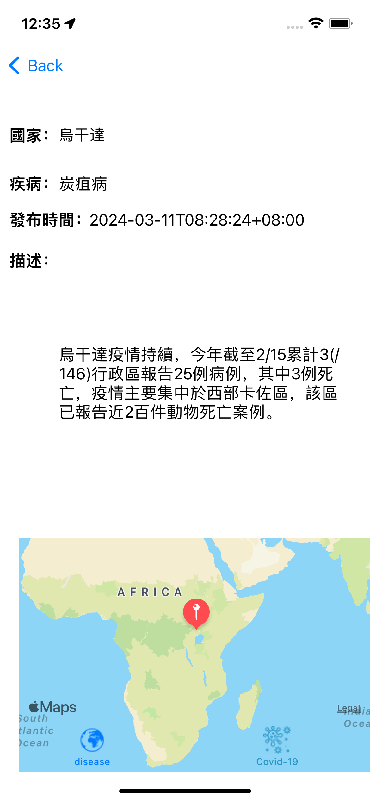

# Global Disease Tracker

### Description

- Global Disease Tracker is an iOS app designed to provide users with real-time information on prevalent diseases across different continents.
- Users can select continents of interest and view a list of countries along with the current prevalent diseases in each country.
- The app aims to raise awareness about diseases worldwide and empower users to make informed decisions regarding their health and travel plans.

### Installation

- Requirements: iOS 15.5 or later.

### Screenshot
- Select continents:

- Prevalent diseases:

- Disease info:

